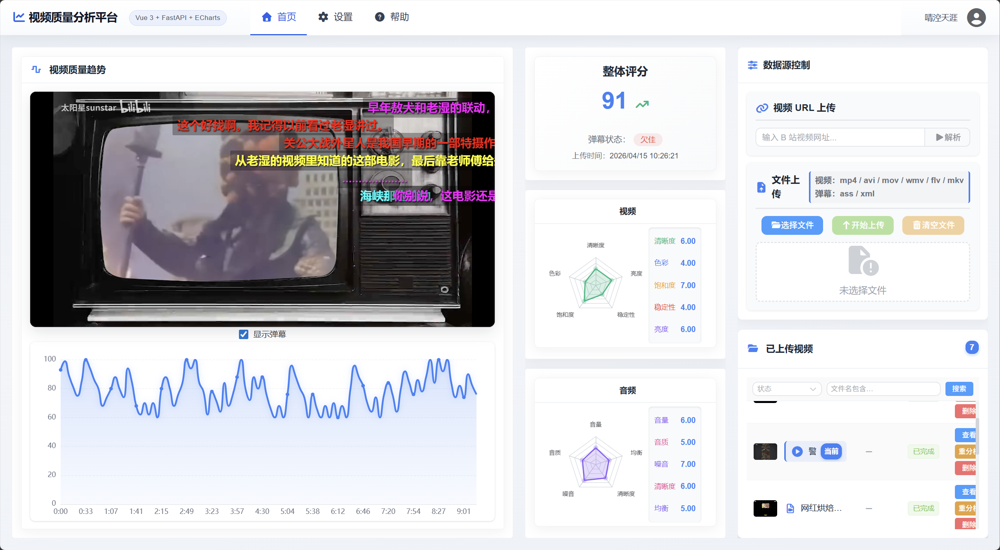

<div align="center">

# Multimodal Video Quality Analysis

**短视频多模态质量分析（MVQA）** — 基于 FastAPI 与 Vue 3 的全栈应用，支持本地上传 / B 站链接、弹幕对齐、多模态打分与可视化仪表盘。

<br/>

<!-- 顶栏横幅：建议尺寸约 1200×400，透明或深色底均可 -->


<sub>将展示用横幅保存为 <code>docs/images/banner.png</code>；若暂未提供图片，此处会显示裂图，属正常现象。</sub>

</div>

---

## 功能概览

| 模块 | 说明 |
|------|------|
| **视频接入** | 本地上传、批量上传、B 站 URL 拉取（含下载调度 `download_registry`） |
| **多模态分析** | 视觉 / 音频 / 文本（Whisper ASR）与融合模型 MVQA，见 `mvqa_analyzer` · `services` |
| **任务调度** | FastAPI `BackgroundTasks` 异步分析（`job_queue`），无需 Redis/Celery |
| **认证与权限** | B 站扫码相关流程、JWT、管理员 mid 与环境变量合并（`settings` · `admin_mids_store`） |
| **配置与合规** | 用户级 `Setting`、敏感词 DFA/规则（`utils/sensitive_rules`）、可选 S3 流式重定向（`storage`） |
| **前端体验** | Vue 3 + Vite + Element Plus + ECharts，开发时代理 `/api` 与 `/uploads` |

---

## 页面预览（预留配图位）

以下为推荐截图文件名与说明，**将 PNG / WebP 放入 `docs/images/`** 后即可在 README 中正常显示。

<p align="center">
  <b>总览 / 首页</b><br/>
  
</p>
<p align="center"><sub>文件：<code>docs/images/01-home.png</code></sub></p>

<p align="center">
  <b>数据图表 / 质量维度</b><br/>
  
</p>
<p align="center"><sub>文件：<code>docs/images/02-charts.png</code></sub></p>

<p align="center">
  <b>上传与任务列表</b><br/>
  
</p>
<p align="center"><sub>文件：<code>docs/images/03-upload-list.png</code></sub></p>

<p align="center">
  <b>设置与模型/处理参数</b><br/>
  
</p>
<p align="center"><sub>文件：<code>docs/images/04-settings.png</code></sub></p>

<p align="center">
  <b>登录 / B 站相关流程（若有独立页）</b><br/>
  
</p>
<p align="center"><sub>文件：<code>docs/images/05-login.png</code></sub></p>

---

## 技术栈

| 层级 | 技术 |
|------|------|
| 后端 | Python **3.9+**，FastAPI，Uvicorn，SQLAlchemy，SQLite（库文件位于**项目根目录** `video_rating.db`） |
| 深度学习 | PyTorch，TorchAudio，Transformers（ViT / AST / RoBERTa / Whisper 等，路径见 `backend/config.py`） |
| 音视频 | OpenCV、MoviePy、Librosa 等（见 `backend/requirements.txt`） |
| 前端 | Vue 3，Vite 7，Vue Router，Pinia，Element Plus，ECharts |
| 容器 | Docker Compose：后端镜像 + Nginx 前端；构建上下文见仓库内 `docker-compose.yml` |

---

## 仓库与模型（Git LFS）

`backend/model/` 下大体积权重由 **Git LFS** 跟踪（规则见 `.gitattributes`）。克隆后请执行：

```bash
git lfs install
git clone <本仓库 URL>
```

并确保 GitHub 账号 **LFS 存储与带宽** 在配额内。

### Whisper Medium 主权重（未入库）

GitHub **单个 LFS 对象最大 2 GiB**。`backend/model/whisper-medium/model.safetensors` 约 **2.9 GiB**，无法推送至 GitHub，已写入 `.gitignore`。请在本机该目录下自行放置同名文件，或用 Hugging Face 拉取与默认 `config.py` 中 `whisper-medium` 目录结构一致的内容，例如：

```bash
pip install -U "huggingface_hub[cli]"
huggingface-cli download openai/whisper-medium --local-dir backend/model/whisper-medium
```

若已存在部分小文件，仅需补全缺失的 `model.safetensors` 时，可只下载该文件（以 Hub 上实际文件名准）。

---

## 本地开发

### 1. 后端

```bash
cd <项目根目录>
python -m venv .venv
# Windows: .venv\Scripts\activate
pip install -r backend/requirements.txt
```

从**项目根目录**启动（保证包名 `backend` 与 `database.py` 中项目根路径一致）：

```bash
uvicorn backend.main:app --reload --host 0.0.0.0 --port 8000
```

健康检查：<http://127.0.0.1:8000/api/health>

### 2. 前端

```bash
cd frontend
npm ci
npm run dev
```

默认通过 Vite 将 `/api`、`/uploads` 代理到 `http://127.0.0.1:8000`（可在 `frontend` 目录配置 `.env` 中的 `VITE_DEV_API_TARGET`）。

生产构建：

```bash
npm run build
```

### 3. 环境变量（可选）

与 `backend/settings.py` 对应：

| 变量 | 含义 |
|------|------|
| `JWT_SECRET` | JWT 签名密钥（**生产务必修改**） |
| `ACCESS_TOKEN_EXPIRE_MINUTES` | 访问令牌有效分钟数 |
| `CORS_ORIGINS` | 允许的前端来源，逗号分隔 |
| `ADMIN_BILIBILI_MIDS` | 管理员 B 站 mid，逗号分隔 |

---

## Docker

在项目根目录：

```bash
docker compose up -d --build
```

- 后端：<http://localhost:8000>
- 前端（Nginx）：<http://localhost:80>（反代 `/api` 与 `/uploads` 至后端）

SQLite 默认在容器内 ` /app/video_rating.db`；若需持久化，见 `docker-compose.yml` 内注释挂载。

---

## 目录结构（节选）

```text
.
├── backend/           # FastAPI 应用、MVQA 管线、模型与工具
│   ├── main.py        # 应用入口与路由
│   ├── database.py    # SQLite 路径（项目根）
│   ├── model/         # 权重与网络定义（部分为 LFS）
│   └── utils/         # 音视频、弹幕、敏感词等
├── frontend/          # Vue 3 前端
├── docs/images/       # README 配图（按需添加）
├── docker-compose.yml
└── README.md
```

---

## 许可证

未随仓库提供 `LICENSE` 文件时，默认 **All Rights Reserved**；未经作者同意，不得使用该仓库代码，作者保留该作品的所有权利。
